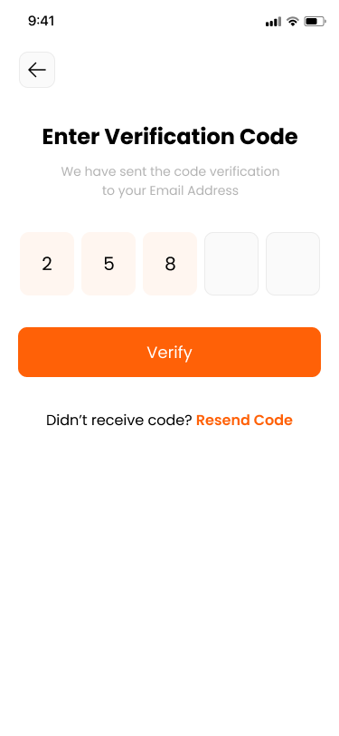
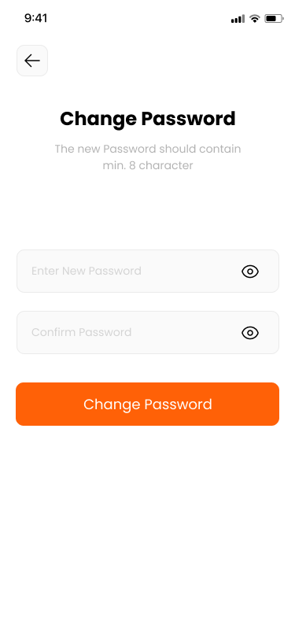

# Flutter Authentication Application

## Overview

This is a Flutter application featuring a complete authentication flow. It includes the following screens:

- Onboarding Screen
- Login Screen
- Sign-Up Screen
- Forgot Password Screen
- OTP Verification Screen
- New Password Screen

The app is designed with a clean and intuitive user interface, ensuring a seamless user experience.

---

## Features

- **Onboarding:** A welcome screen that introduces users to the app.
- **Login:** Allows existing users to access their accounts.
- **Sign-Up:** Enables new users to create an account.
- **Forgot Password:** Helps users reset their password.
- **OTP Verification:** Verifies the user’s identity using a one-time password.
- **New Password:** Allows users to set a new password after verification.

---

## Screenshots

Below are screenshots of the app, arranged in a grid of 4 per row:

|  |  |  |  |
|-------------------------------------------|-------------------------------------------|-------------------------------------------|-------------------------------------------|
|  |  |  |  |

---

## Setup Instructions

1. **Clone the Repository:**
   ```bash
   git clone <repository-url>
   ```

2. **Navigate to the Project Directory:**
   ```bash
   cd <project-directory>
   ```

3. **Install Dependencies:**
   ```bash
   flutter pub get
   ```

4. **Run the App:**
   ```bash
   flutter run
   ```

---

## Folder Structure

```
lib/
|-- main.dart
|-- screens/
    |-- onboarding_screen.dart
    |-- login_screen.dart
    |-- signup_screen.dart
    |-- forgot_password_screen.dart
    |-- otp_screen.dart
    |-- new_password_screen.dart
|-- widgets/
    |-- custom_button.dart
    |-- custom_text_field.dart
|-- utils/
    |-- constants.dart
```

---

## Dependencies

Below are the major dependencies used in this project:

- **flutter:** The core framework.
- **provider:** State management.
- **flutter_svg:** To render SVG assets.
- **http:** For API calls.

To view the complete list, check the `pubspec.yaml` file.

---

## Contributing

Contributions are welcome! Follow these steps to contribute:

1. Fork the repository.
2. Create a new branch.
3. Make your changes and commit them.
4. Push to your fork and submit a pull request.

---

## License

This project is licensed under the MIT License. See the LICENSE file for details.

